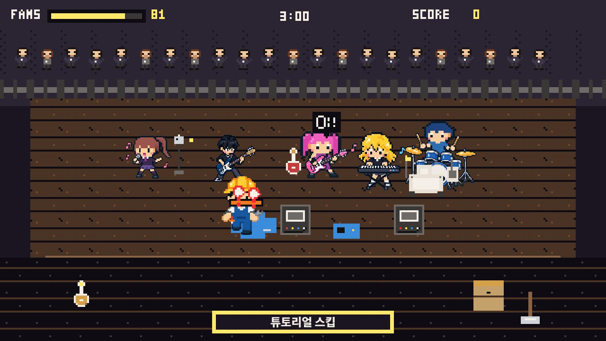
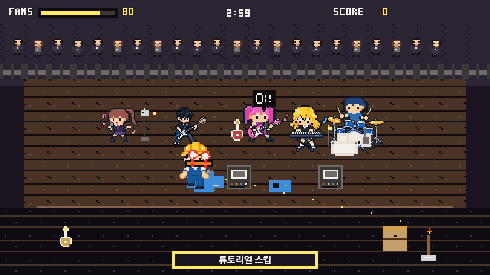
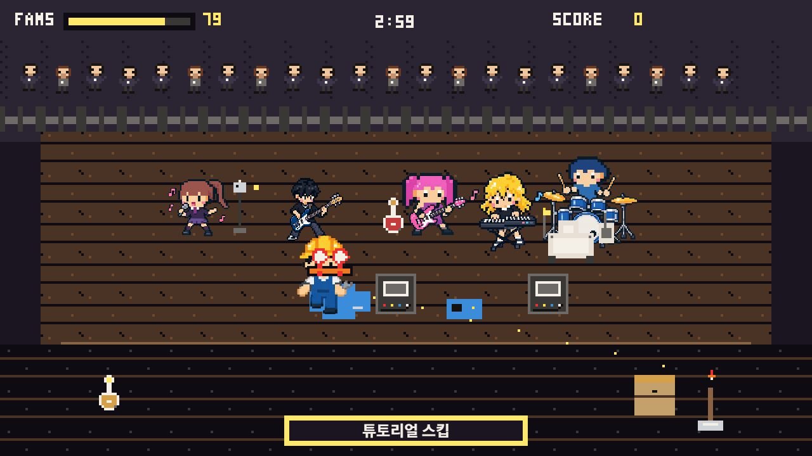
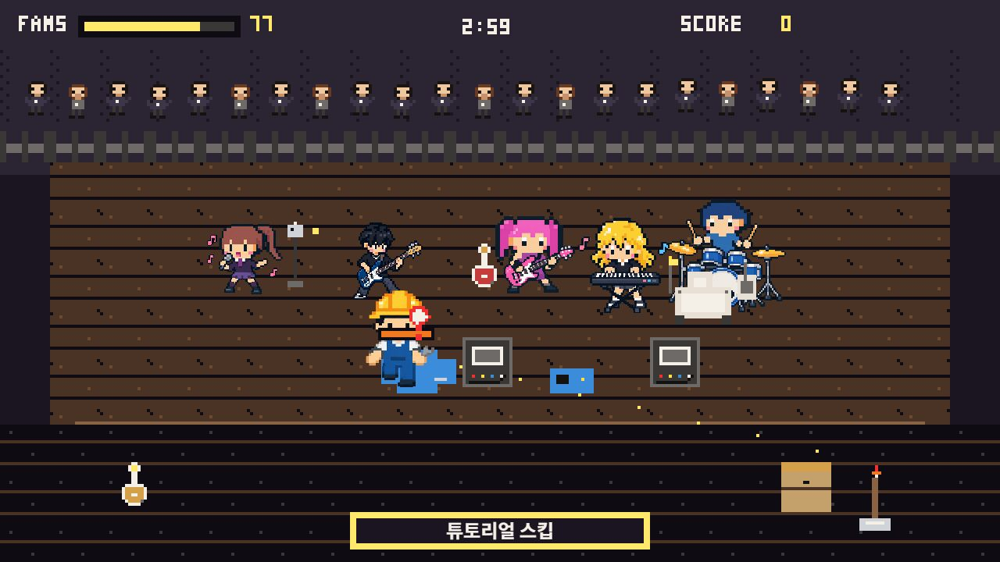
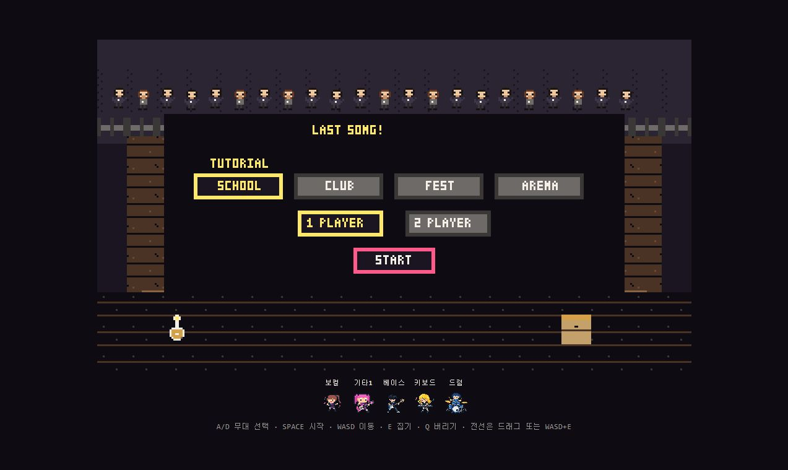
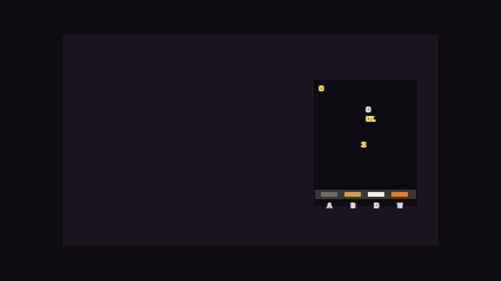
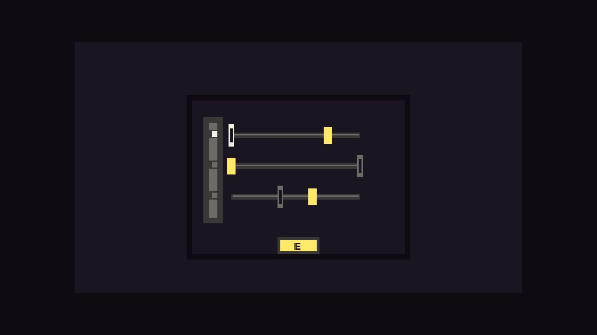
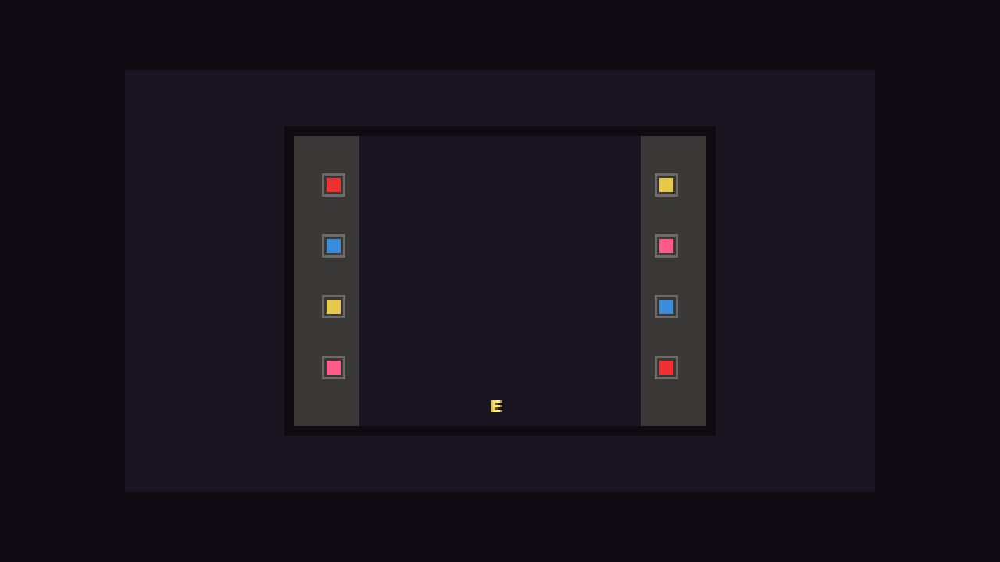
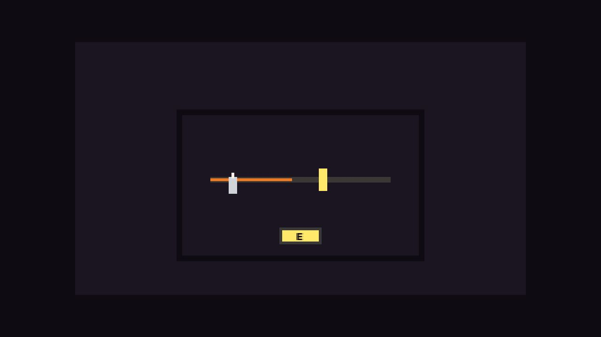

# Development Capture

Codex와 함께 수정한 주요 화면을 캡처로 정리했다.

## Character Motion

플레이어 캐릭터 시트를 방향별로 잘라서 앞, 뒤, 좌우 이동 모션에 연결했다. 좌우 옆모습이 반대로 보이던 문제도 수정했다.

## Band Member Scale

보컬, 기타, 베이스, 키보드, 드럼 이미지는 선택 화면과 무대에서 약 80% 크기로 줄여 화면 밀도를 맞췄다.

## Minigames

난이도 패치 후 미니게임 제한시간을 조금 더 주고, 진행 후반부 시간 압박을 완만하게 조정했다.

